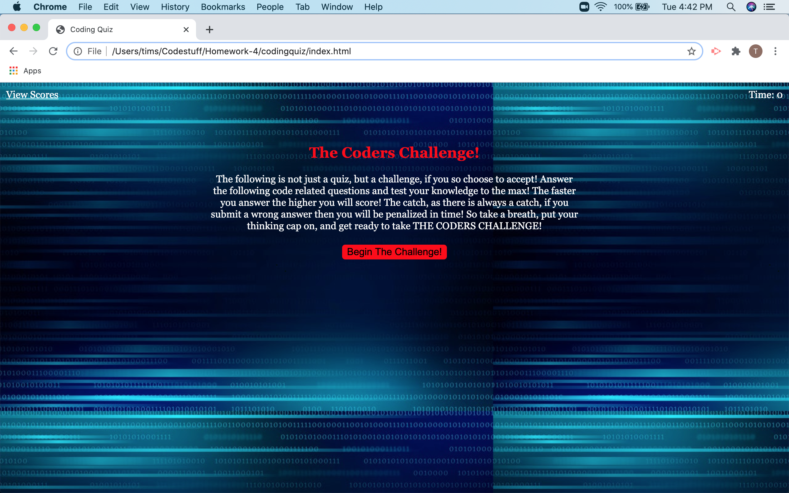

# Coding Challeneg #

[Github pages link](https://tbsanders5.github.io/codingquiz/)

## Description ##
The program consists mainly of Javascript and is a short, 4 question quiz, on some of the rules of javascript. It follows a ceratin order, the questions are multiple choice and the quiz is timed. Your score is however much time is left on the clock when finishing the quiz. If you enter an incorret answer it takes time off of the timer so make sure to choose wisely.

## Resources ##

* [Nancy Lambert-Brown](https://github.com/n-lambert)
* [Plover Brown](https://github.com/rebgrasshopper)
* [Zachary Bryan](https://github.com/zacharybryan)
* [Nicholas Konzen](https://github.com/NTKonzen)
* [Talia Vazquez](https://github.com/taliavazquez)
* [W3 Schools Javascript Quiz](https://www.w3schools.com/quiztest/quiztest.asp?qtest=JS)

## Usage ##

1. Click "Begin the Challenge" to start the quiz.
1. Select a multiple choice answer to each question.
1. Once all questions have received an answer you will be provided a score.
1. Enter your initials and hit submit to see your score on the scores page.
1. You can click clear scores once on the page in order to erase all scores.
1. The return button will take you back to the beginning of the quiz.
1. The link in the top left can also take you to the scores page.
1. Timer in the top right keeps track of how much time you have to complete.

## License ##

GNU General Public License

---

Copyright (c) 2020 Sanders, Timothy

Permission is hereby granted, free of charge, to any person obtaining a copy
of this software and associated documentation files (the "Software"), to deal
in the Software without restriction, including without limitation the rights
to use, copy, modify, merge, publish, distribute, sublicense, and/or sell
copies of the Software, and to permit persons to whom the Software is
furnished to do so, subject to the following conditions:

The above copyright notice and this permission notice shall be included in all
copies or substantial portions of the Software.

THE SOFTWARE IS PROVIDED "AS IS", WITHOUT WARRANTY OF ANY KIND, EXPRESS OR
IMPLIED, INCLUDING BUT NOT LIMITED TO THE WARRANTIES OF MERCHANTABILITY,
FITNESS FOR A PARTICULAR PURPOSE AND NONINFRINGEMENT. IN NO EVENT SHALL THE
AUTHORS OR COPYRIGHT HOLDERS BE LIABLE FOR ANY CLAIM, DAMAGES OR OTHER
LIABILITY, WHETHER IN AN ACTION OF CONTRACT, TORT OR OTHERWISE, ARISING FROM,
OUT OF OR IN CONNECTION WITH THE SOFTWARE OR THE USE OR OTHER DEALINGS IN THE
SOFTWARE.